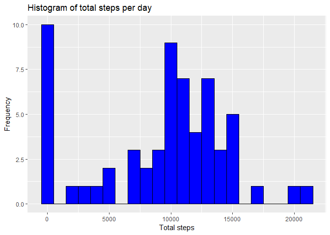
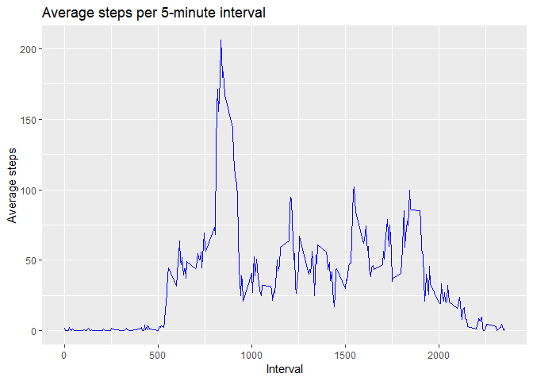
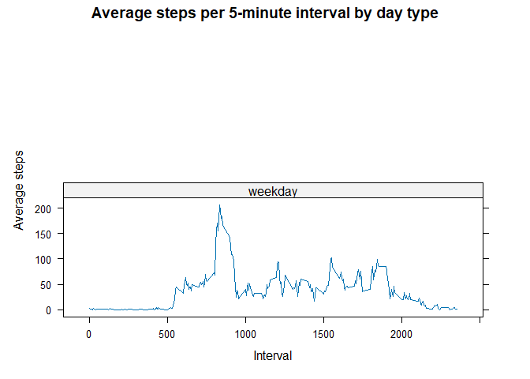

\#Loading and preprocessing the data

    # Load necessary packages
    library(dplyr)
    library(ggplot2)
    library(lattice)

    # Load data
    data <- read.csv("activity.csv")
    data$date <- as.Date(data$date, format="%Y-%m-%d")
    head(data)

    ##   steps       date interval
    ## 1    NA 2012-10-01        0
    ## 2    NA 2012-10-01        5
    ## 3    NA 2012-10-01       10
    ## 4    NA 2012-10-01       15
    ## 5    NA 2012-10-01       20
    ## 6    NA 2012-10-01       25

\#What is mean total number of steps taken per day?

    # Summarize steps per day
    daily_steps <- data %>%
      group_by(date) %>%
      summarise(total_steps = sum(steps, na.rm = TRUE), .groups = 'drop')

    # Plot histogram
    ggplot(daily_steps, aes(x = total_steps)) +
      geom_histogram(binwidth = 1000, fill = "blue", color = "black") +
      labs(title = "Histogram of total steps per day", x = "Total steps", y = "Frequency")

    # Mean and median steps per day
    mean_steps <- mean(daily_steps$total_steps, na.rm = TRUE)
    median_steps <- median(daily_steps$total_steps, na.rm = TRUE)

    mean_steps

    ## [1] 9354.23

    median_steps

    ## [1] 10395

\#What is the average daily activity pattern?

    # Average steps per interval
    interval_steps <- data %>%
      group_by(interval) %>%
      summarise(mean_steps = mean(steps, na.rm = TRUE), .groups = 'drop')

    # Time series plot
    ggplot(interval_steps, aes(x = interval, y = mean_steps)) +
      geom_line(color = "blue") +
      labs(title = "Average steps per 5-minute interval", x = "Interval", y = "Average steps")

    # Interval with max steps
    max_interval <- interval_steps[which.max(interval_steps$mean_steps), ]
    max_interval

    ## # A tibble: 1 × 2
    ##   interval mean_steps
    ##      <int>      <dbl>
    ## 1      835       206.

\#Imputing missing values

    # Total NA values
    total_na <- sum(is.na(data$steps))
    total_na

    ## [1] 2304

    # Fill missing values
    data_filled <- data %>%
      group_by(interval) %>%
      mutate(steps = ifelse(is.na(steps), mean(steps, na.rm = TRUE), steps), .groups = 'drop')

    sum(is.na(data_filled$steps))

    ## [1] 0

\#Are there differences in activity patterns between weekdays and
weekends?

    # Add day type
    data_filled <- data_filled %>%
      mutate(day_type = ifelse(weekdays(date) %in% c("Saturday", "Sunday"), "weekend", "weekday"))

    # Average steps per interval by day type
    interval_steps_filled <- data_filled %>%
      group_by(interval, day_type) %>%
      summarise(mean_steps = mean(steps), .groups = 'drop')

    # Panel plot
    xyplot(mean_steps ~ interval | day_type, data = interval_steps_filled, type = "l",
           layout = c(1, 2), xlab = "Interval", ylab = "Average steps",
           main = "Average steps per 5-minute interval by day type")

